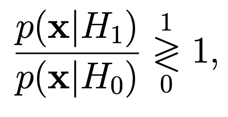

# Автоматическое распознавание открытых текстов

## Что это?
Реализация системы распознавания открытого текста (осмысленного текста для данного языка) по правилу
максимума правдоподобия (МП) на основе посимвольной модели.

Затем производится проверка возможности взлома шифра Цезаря методом лобовой атаки (перебрав все ключи)
на основе реализованной системы распознавания текста. Т.е. перебираются все ключи. И только одна из возможной комбинации 
будет открытым текстом.

## Принцип работы распознавания

1. Считаем вероятность появления букв на примере большого текста. Я использовал произведени: "война и мир".
2. Получаем `letter_prob` - словарь содержащий значения `[буква : вероятность появления буквы в тексте]`. Алфавит из 32 символов без `ё`
3. что-то еще

`H0` - вычисляет энтропию (количество информации на символ) реального текста (войны и мира), используя формулу Шеннона

`H1` - энтропия зашифрованного текста путем суммирования логарифмов вероятностей каждого символа в тексте

Если разность `H1 - H0` больше нуля, то текст признается открытым, иначе - закрытым

## Теория
При распознавании необходимо вынести решение в пользу одной из гипотез:
 
 - текст не является открытым (осмысленным для
заданного языка)

 - текст является открытым

Решающее правило МП (максимального правдоподобия) имеет вид:
 

 - текст из N символов
 
 - функция правдоподобия для гипотезы
.

Функция правдоподобия при использовании посимвольной модели текста может быть вычислена по формуле:

    

где  - вероятность появления символа 
 при условии истинности гипотезы
. В случае истинности гипотезы 
 эта вероятность соответствует распределению вероятностей символов для русского языка, а при истинности 
 можно
предположить равновероятное распределение символов.

